<div align="center">


<h3>Network Defense — Siber Güvenlik Eğitim &amp; CTF Operasyon Platformu</h3>

<a href="https://git.io/typing-svg">
  
</a>

<br/><br/>


<br/><br/>

<a href="https://defendia.bluenetwork.dev/">
  
</a>

</div>

---

## Genel Bakış

DEFENDIA, operatörlerin (kullanıcıların) zafiyetli makineleri sömürerek, bayrak (flag) yakalayarak ve operasyon senaryolarını tamamlayarak puan topladığı, seviye atladığı ve takımlar hâlinde yarıştığı bir siber güvenlik eğitim platformudur.

Platformun arkasında **Proxmox VE** sanallaştırma altyapısı çalışır. Her laboratuvar makinesi ve kişisel çalışma ortamı, talep anında gerçek bir sanal makine (VM) olarak klonlanır, operatöre atanır ve süresi dolduğunda otomatik olarak temizlenir.

**Mimari:** Node.js + Express 5 tabanlı monolitik uygulama. Sunucu tarafı EJS render, istemci tarafı Fetch API. Gerçek zamanlı bildirim ve sohbet akışı Server-Sent Events (SSE) ile sağlanır. Veri katmanı dosya tabanlı JSON deposu üzerine kuruludur.

## Canlı Demo

Platformu kurulum yapmadan incelemek için hazır bir demo ortamı mevcuttur:

| | |
|---|---|
| **Adres** | https://defendia.bluenetwork.dev/ |
| **Kullanıcı adı** | `demo` |
| **Şifre** | `12345678` |

> Demo hesabı inceleme amaçlıdır. Proxmox altyapısı gerektiren lab/HackerBox başlatma işlemleri demo ortamında sınırlı olabilir; arayüz, senaryolar, CTF görevleri ve sıralama sistemi tam olarak gezilebilir.

## Öne Çıkan Özellikler

### Operatör Tarafı

| Alan | Özellikler |
|------|-----------|
| Kimlik & Profil | Kayıt/giriş (bcrypt), avatar yükleme, biyografi, kendi şifresini değiştirme, herkese açık profil |
| Kontrol Paneli | Toplam ve kalan puan, lab/CTF/senaryo ilerlemesi, sıradaki hedef önerileri, son çözümler, kategori ustalaması |
| Laboratuvar | Zorluk/duruma göre filtre, tek tıkla makine başlatma, canlı IP, flag ile çözme |
| CTF | Steganografi, Kriptoloji, Adli Bilişim, Web Güvenliği, Tersine Mühendislik, OSINT; dosya indirme ve flag gönderimi |
| Senaryolar | Çok adımlı, hikâye tabanlı operasyonlar; sıralı görev ilerlemesi |
| HackerBox | Kişisel Linux çalışma ortamı, tarayıcı içi noVNC erişimi, süre uzatma |
| Sosyal | Takım kurma/yönetme, takım sohbeti, özel ve grup mesajlaşma, engelleme, okundu bilgisi |
| Rekabet | Bireysel ve takım sıralaması, ilk kan (first blood) sistemi, rozetler |
| Destek | Kategori bazlı destek talebi (ticket) oluşturma ve yazışma |
| Bildirim | Anlık SSE bildirimleri; çevrimdışıyken bekletilip bağlanınca teslim |

### Yönetici Tarafı (Admin Panel)

| Alan | Özellikler |
|------|-----------|
| Sistem İzleme | Canlı Proxmox verisi: node CPU/RAM, disk kullanımı, çalışan VM listesi |
| İçerik Yönetimi | Lab / CTF / Senaryo ekle-düzenle-sil, dosya ve banner yükleme |
| Operatör Yönetimi | Kullanıcı silme, şifre sıfırlama, ilerleme sıfırlama, aktif VM'i durdurma |
| Yasaklama | Süreli/süresiz ban, otomatik süre dolumu, anlık oturum sonlandırma |
| Duyuru & Bildirim | Global duyuru, hedefli bildirim, toplu yayın, çevrimiçi kullanıcı listesi |
| Takım / Rozet / İlk Kan | Takım silme, rozet oluşturma ve atama, ilk kan kayıtlarını yönetme |
| Destek | Tüm talepleri görüntüleme, yanıtlama, durum değiştirme |

## Ekran Görüntüleri

### Kontrol Paneli
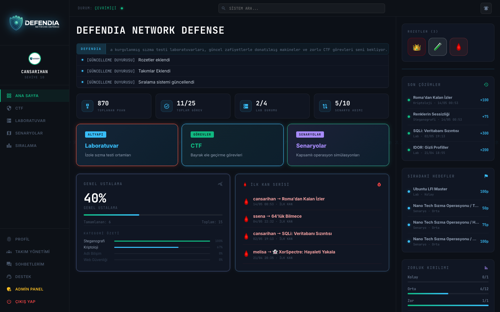

### CTF — Bayrak Görevleri
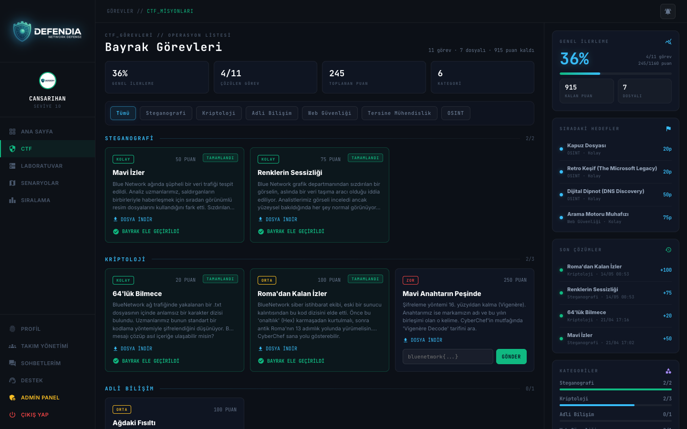

### Laboratuvar
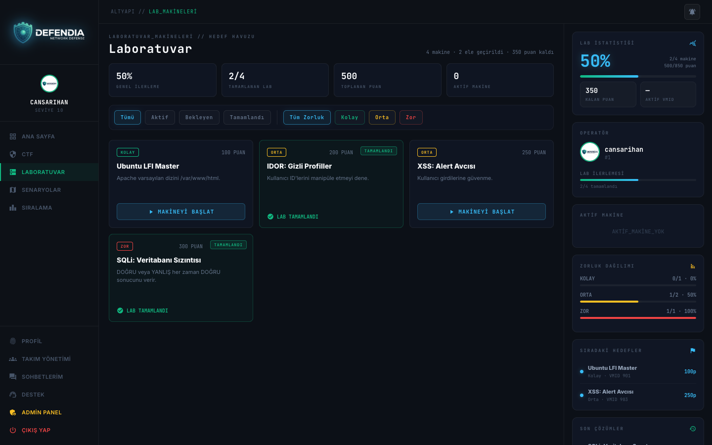

### Operasyon Senaryoları
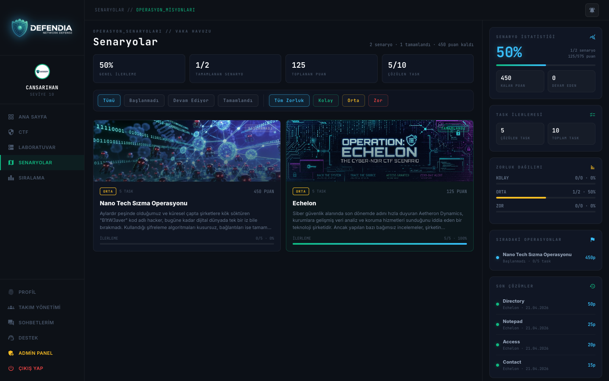

### Operatör Sıralaması
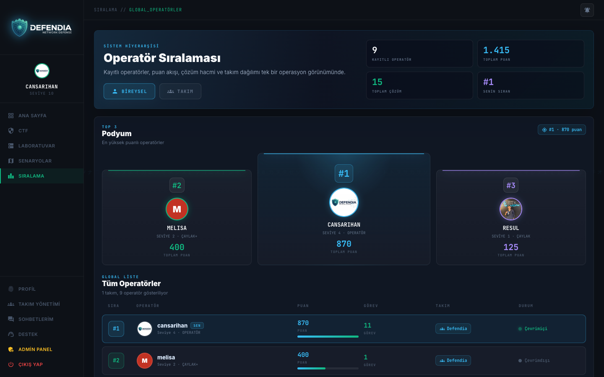

### Takım Yönetimi
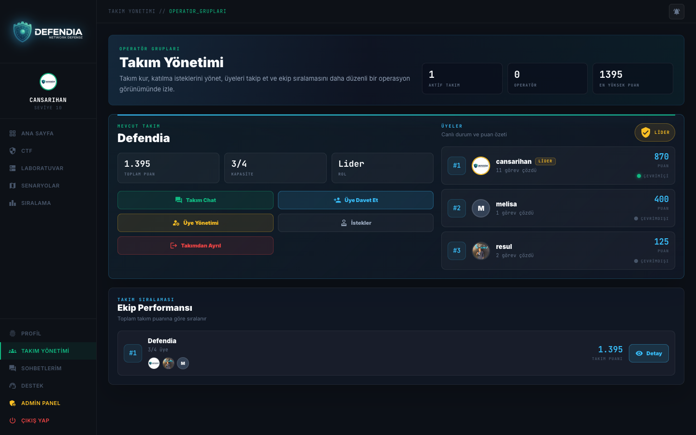

### Admin Panel
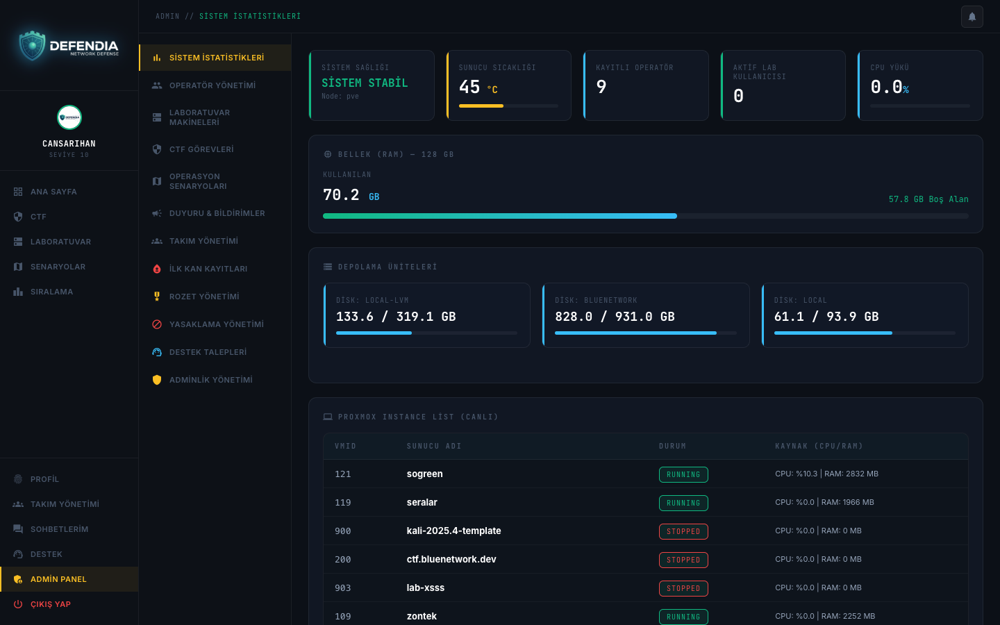

### Profil
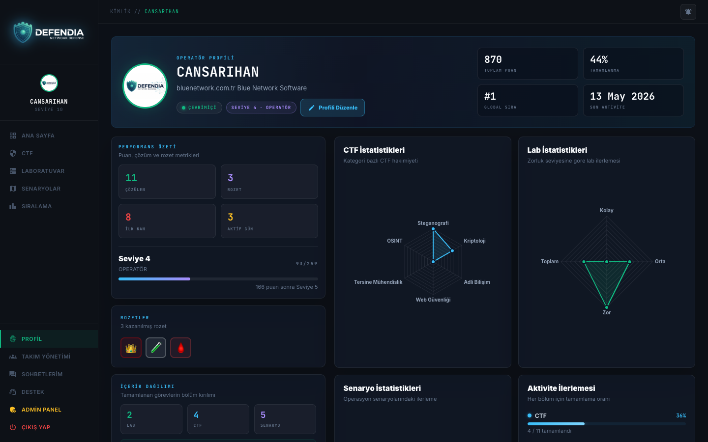

## Sistem Mimarisi

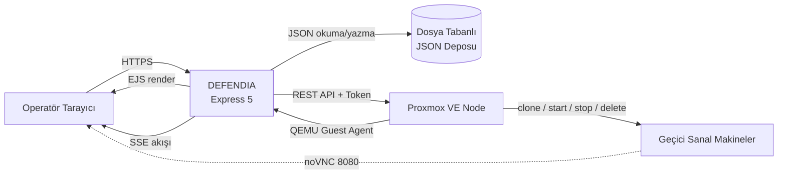

Uygulama, Proxmox ile **API Token** üzerinden konuşur. Bağlantı bilgileri (sunucu adresi, node adı, token) yalnızca `.env` dosyasında tutulur; kaynak kodda veya depoda gerçek değer bulunmaz.

## Nasıl Çalışır — Proxmox ve Sanal Makine Yaşam Döngüsü

Platform iki tür canlı VM yönetir: kısa ömürlü **laboratuvar makineleri** ve kişisel **HackerBox** ortamı. Her ikisi de önceden hazırlanmış **şablon VM'lerden** klonlanır.

### VM ID Aralıkları

| Tür | Şablon Kaynağı | Klon ID Aralığı | Klon Tipi | Süre |
|-----|----------------|-----------------|-----------|------|
| Laboratuvar | Lab tanımındaki şablon VMID | `10000 – 99999` (rastgele) | Bağlı klon (hızlı) | 1 saat |
| HackerBox | `HACKERBOX_TEMPLATE_VMID` (varsayılan 110) | `20000 – 28999` (rastgele) | Tam klon (bağımsız) | 1 saat, uzatılabilir |

### Laboratuvar Makinesi Akışı

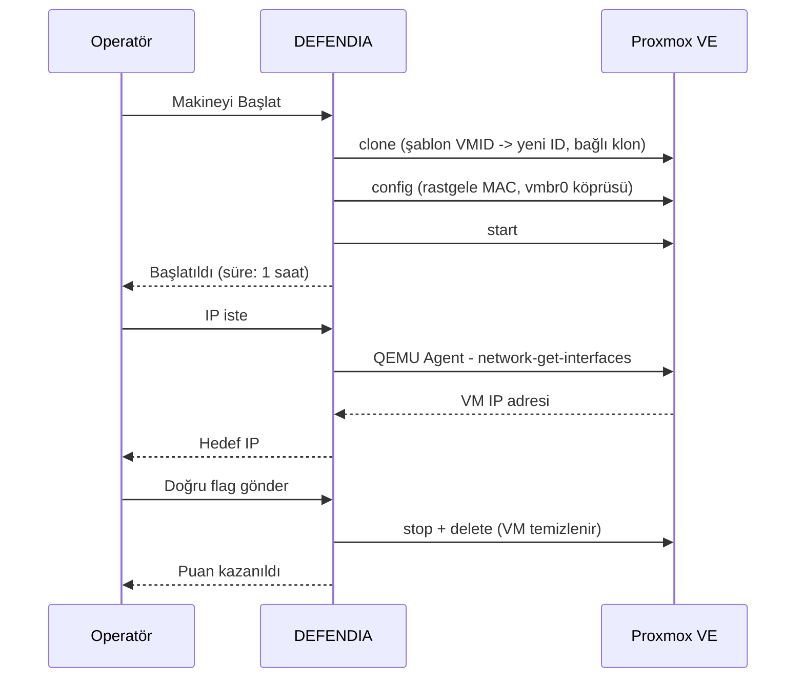

Adım adım:

1. **Klonlama** — Operatör bir lab başlattığında, ilgili şablon VMID'den `10000–99999` aralığında rastgele bir ID ile bağlı klon (linked clone) oluşturulur. Bağlı klon, tam kopyaya göre çok daha hızlı hazırlanır.
2. **Ağ yapılandırması** — Klona rastgele bir MAC adresi atanır ve `vmbr0` köprüsüne bağlanır. Böylece her operatörün makinesi ağda benzersiz olur.
3. **Başlatma** — VM çalıştırılır ve operatöre 1 saatlik kullanım süresi tanımlanır.
4. **IP çözümleme** — Hedef IP, VM içindeki **QEMU Guest Agent** üzerinden alınır ve bir kez çözüldükten sonra önbelleğe yazılır.
5. **Temizleme** — Operatör doğru flag'i gönderdiğinde ya da 1 saatlik süre dolduğunda VM otomatik olarak durdurulur ve silinir. Aynı anda yalnızca bir aktif lab bulunabilir.

### HackerBox Akışı

HackerBox, operatöre ait tarayıcı üzerinden erişilen kişisel bir Linux ortamıdır:

1. Şablon VM (`HACKERBOX_TEMPLATE_VMID`) `20000–28999` aralığında bir ID ile **tam klon** olarak oluşturulur.
2. Klonlamanın tamamlanması, VM durumu düzenli aralıklarla sorgulanarak (polling) beklenir; işlem arka planda yürütülür, operatör beklemez.
3. MAC atanır, VM başlatılır ve IP QEMU Guest Agent ile çözülür.
4. Erişim, VM üzerindeki **noVNC** servisi (varsayılan port 8080) üzerinden tarayıcı içinde sağlanır.
5. Süre 1 saattir; operatör isterse uzatabilir, işi bitince bağlantıyı keserek VM'i silebilir.

### Yönetici Canlı İzleme

Admin panel, Proxmox node üzerinden üç API çağrısını paralel yaparak canlı durum sunar: node genel durumu (CPU/RAM), depolama birimleri ve çalışan VM listesi. Proxmox'a ulaşılamazsa panel sessizce boş veriyle döner, uygulama bloke olmaz.

## Altyapı Kurulumu — Proxmox Şablonları ve noVNC

Bu bölüm, platformun canlı VM özelliklerini sıfırdan çalışır hâle getirmek için Proxmox tarafında yapılması gerekenleri açıklar.

### 1. Proxmox API Token Oluşturma

Uygulama, Proxmox'a şifre yerine API token ile bağlanır.

```bash
# Proxmox node üzerinde (ya da web arayüzü: Datacenter > Permissions > API Tokens)
# 1) Uygulama için bir kullanıcı oluşturun
pveum user add defendia@pam

# 2) VM klonlama/başlatma/silme yetkileri verin (gerekirse özel bir rol tanımlayın)
pveum acl modify / --users defendia@pam --roles PVEVMAdmin

# 3) API token üretin (çıktıdaki "value" değerini saklayın)
pveum user token add defendia@pam defendia-token --privsep 0
```

Elde edilen token'ı `.env` içine yazın:

```
PVE_NODE=pve
PVE_IP=PROXMOX_SUNUCU_IP
PVE_API_TOKEN=PVEAPIToken=defendia@pam!defendia-token=xxxxxxxx-xxxx-xxxx-xxxx-xxxxxxxxxxxx
```

> Uygulama, self-signed sertifikalı Proxmox kurulumlarıyla çalışabilmek için TLS doğrulamasını gevşetir. Üretimde geçerli bir sertifika kullanmanız önerilir.

### 2. Laboratuvar Şablon VM'i Hazırlama

Her lab makinesi, önceden hazırlanmış bir şablondan klonlanır. Şablonun düzgün çalışması için iki koşul kritiktir:

1. **QEMU Guest Agent kurulu ve etkin olmalı** — Uygulama, VM'in IP adresini bu agent üzerinden öğrenir. Agent yoksa hedef IP hiçbir zaman görünmez.
2. **DHCP ile IP alan bir ağ arayüzü** — Klonlara rastgele MAC atanıp `vmbr0` köprüsüne bağlanır; bu köprüde bir DHCP servisi bulunmalıdır.

```bash
# Klonlanacak VM içinde (Debian/Ubuntu tabanlı):
sudo apt update && sudo apt install -y qemu-guest-agent
sudo systemctl enable --now qemu-guest-agent

# Proxmox tarafında VM için agent'ı açın:
qm set <VMID> --agent enabled=1
```

Zafiyeti ve flag'i yerleştirdikten sonra VM'i kapatın. Bu VM'in ID'sini admin panelde ilgili lab tanımına şablon olarak girin. Uygulama, operatör "başlat" dediğinde bu VMID'yi `10000–99999` aralığında yeni bir ID'ye **bağlı klon** olarak kopyalar.

### 3. HackerBox Ortamı ve noVNC Kurulumu

HackerBox, operatörün tarayıcıdan eriştiği kişisel Linux masaüstüdür. Erişim, VM içinde çalışan bir **noVNC** servisi üzerinden sağlanır (varsayılan port 8080). Şablon VM içinde aşağıdaki adımlar uygulanır:

```bash
# Bir masaüstü ortamı ve VNC sunucusu kurun
sudo apt update
sudo apt install -y xfce4 xfce4-goodies tigervnc-standalone-server novnc websockify qemu-guest-agent
sudo systemctl enable --now qemu-guest-agent

# VNC şifresini belirleyin (.env içindeki HACKERBOX_VNC_PASSWORD ile aynı olmalı)
vncpasswd

# noVNC'yi, VNC (5901) portunu 8080 üzerinden web'e açacak şekilde çalıştırın.
# Bunu bir systemd servisi hâline getirmeniz, VM her açıldığında otomatik başlaması için önerilir.
websockify --web=/usr/share/novnc 8080 localhost:5901
```

Örnek systemd servisleri (VM açılışında otomatik başlaması için):

```ini
# /etc/systemd/system/hackerbox-vnc.service
[Unit]
Description=HackerBox VNC
After=network.target
[Service]
User=hacker
ExecStart=/usr/bin/vncserver :1 -localhost no -geometry 1440x900
Restart=always
[Install]
WantedBy=multi-user.target
```

```ini
# /etc/systemd/system/hackerbox-novnc.service
[Unit]
Description=HackerBox noVNC Bridge
After=hackerbox-vnc.service
[Service]
ExecStart=/usr/bin/websockify --web=/usr/share/novnc 8080 localhost:5901
Restart=always
[Install]
WantedBy=multi-user.target
```

Servisleri etkinleştirip VM'i kapatın:

```bash
sudo systemctl enable hackerbox-vnc hackerbox-novnc
```

Bu VM'in ID'sini `.env` içindeki `HACKERBOX_TEMPLATE_VMID` değerine yazın. Operatör HackerBox'a bağlandığında uygulama şu adımları izler: şablonu `20000–28999` aralığında **tam klon** olarak kopyalar, klon hazır olana kadar durumunu sorgular, MAC atar, başlatır, IP'yi agent ile çözer ve tarayıcıda şu adresi açar:

```
http://<VM_IP>:8080/vnc.html?autoconnect=true&password=<VNC_ŞİFRESİ>
```

### 4. Özet Akış

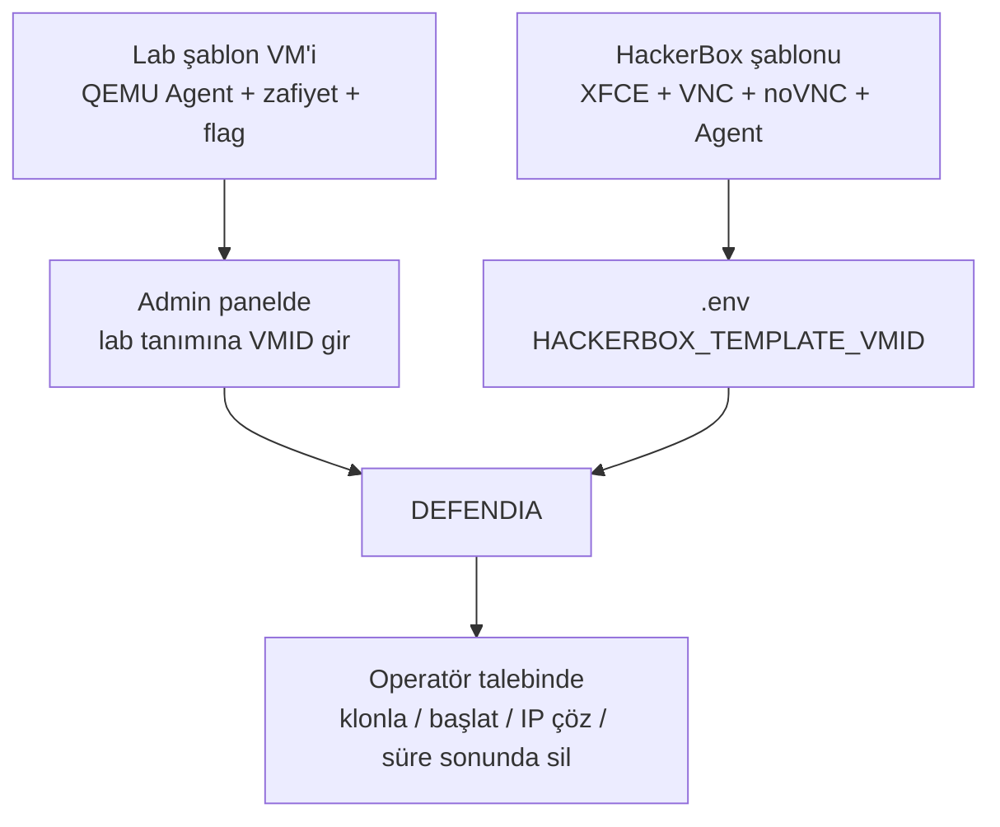

## Kurulum

```bash
# 1) Bağımlılıkları yükleyin
npm install

# 2) Ortam değişkenlerini hazırlayın
cp .env.example .env
#   .env dosyasını açıp Proxmox bağlantı bilgilerinizi ve
#   SESSION_SECRET değerini kendi değerlerinizle doldurun.

# 3) Uygulamayı başlatın
node app.js
```

Ardından tarayıcıdan `http://localhost:3000` adresine gidin.

> Proxmox entegrasyonu için `.env` içinde `PVE_IP`, `PVE_NODE` ve `PVE_API_TOKEN` değerlerinin tanımlı olması gerekir. Bu değerler olmadan uygulama çalışır ancak lab/HackerBox başlatma işlemleri devre dışı kalır.

## Yapılandırma

Tüm hassas ayarlar ortam değişkenleri üzerinden yönetilir ve depoya dâhil edilmez:

| Değişken | Açıklama |
|----------|----------|
| `PORT` | Uygulama portu (varsayılan 3000) |
| `SESSION_SECRET` | Oturum imzalama anahtarı |
| `PVE_NODE` | Proxmox node adı |
| `PVE_IP` | Proxmox sunucu adresi |
| `PVE_API_TOKEN` | Proxmox API token |
| `HACKERBOX_TEMPLATE_VMID` | HackerBox şablon VM ID'si |
| `HACKERBOX_VNC_PORT` | noVNC portu |
| `HACKERBOX_VNC_PASSWORD` | noVNC erişim şifresi |

## Proje Yapısı

```
.
├── app.js                # Uygulama girişi ve tüm rotalar
├── db.js                 # Kullanıcı veri erişim katmanı
├── data/                 # Lab, CTF, senaryo, takım, rozet, ticket verileri (JSON)
├── views/                # EJS şablonları (dashboard, ctf, lab, admin, teams ...)
│   └── partials/         # Ortak arayüz bileşenleri
├── public/               # Statik dosyalar (css, js, görseller, yüklemeler)
├── docs/screenshots/     # Bu dosyadaki ekran görüntüleri
└── .env.example          # Ortam değişkeni şablonu
```

## Teknoloji Yığını

| Katman | Teknoloji |
|--------|-----------|
| Çalışma zamanı | Node.js |
| Web çatısı | Express 5 |
| Şablon motoru | EJS |
| Oturum & parola | express-session, bcrypt |
| Dosya yükleme | Multer |
| Gerçek zamanlı | Server-Sent Events (SSE) |
| Altyapı | Proxmox VE (REST API, QEMU Guest Agent, noVNC) |
| Güvenlik | express-rate-limit, girdi temizleme, rol tabanlı yetki |

## Yapımcı

**Can Sarıhan** tarafından geliştirilmiştir.

<div align="center">
  <sub>DEFENDIA — Network Defense</sub>
</div>
